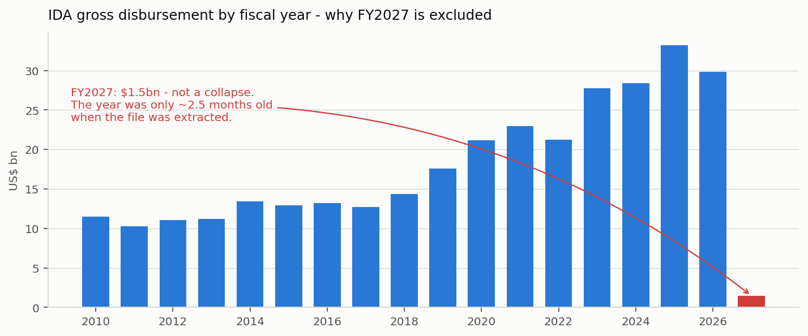
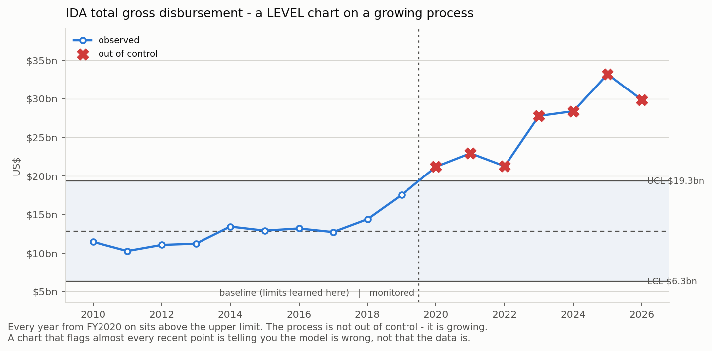
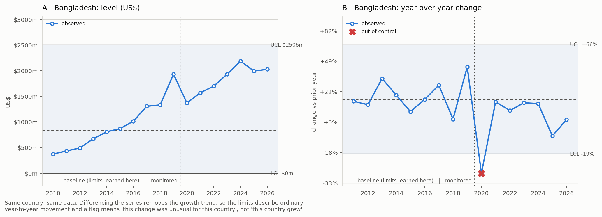

# SPC on IDA net flows — a first anomaly-detection project

A deliberately small project: **one financier (IDA), one measure (gross disbursement), one method (Statistical Process Control)**, on the 374 KB country × fiscal-year extract. The 460 MB credit-level snapshot file is *not* used here — the point is to understand the method on data you can hold in your head first.

**Data:** `data/ibrd_and_ida_net_flows_commitments_09-16-2026.csv` at the repository root — 3,445 rows, 174 countries, FY2010–FY2027, extracted 2026-09-16.

---

## Run it

```bash
pip install -r requirements.txt
python src/step1_prepare.py    # bronze -> silver, plus the fixed-rule layer
python src/step2_spc.py        # the control charts
python src/step3_evaluate.py   # how good is it? (synthetic injection)
python src/step4_report.py     # figures + outputs/FINDINGS.md
```

Everything lands in `outputs/`. Nothing writes back to the shared `data/` folder — the raw file stays raw.

---

## What SPC actually is

One question, asked of every new observation:

> Given how this series behaved in the past, is this point inside the range that ordinary variation produces, or far enough outside that something changed?

You need three numbers: a **centre line** (where the process normally sits), and two **control limits** at centre ± 3σ. A point outside is *out of control* — which in SPC does **not** mean "wrong", it means "this did not come from the same process as the history, go look".

We use an **individuals chart** (one observation per period, no subgroup to average) because a country reports one figure per fiscal year.

### Why median and MAD instead of mean and standard deviation

```python
center = median(x)
sigma  = 1.4826 * median(|x - center|)      # MAD, rescaled
```

A single crisis-year disbursement inflates *both* the mean and the standard deviation. Wider limits then hide every later problem — **the outlier protects itself**. Median and MAD barely move, so the chart keeps its sensitivity. The 1.4826 makes MAD estimate the same quantity as σ for normal data, which is what keeps "3 sigma" meaning the usual thing. → [spc_core.py:20](src/spc_core.py#L20)

### Two windows, never one

| Phase | Years | Role |
|---|---|---|
| I — baseline | FY2010–FY2019 | limits are **learned** here |
| II — monitoring | FY2020–FY2026 | limits are **applied** here |

The limits that judge FY2023 never saw FY2023. That is the same discipline as avoiding data leakage in ML, and it is the difference between a number you can quote and a number that flatters itself. → [config.py:35](src/config.py#L35)

---

## The four things this dataset taught, in order

### 1. FY2027 is not a collapse — it is a partial period

IDA disbursement by fiscal year: FY2025 $33.2bn, FY2026 $29.8bn, **FY2027 $1.5bn**.

The World Bank fiscal year runs 1 July – 30 June and is named for the year it *ends*, so FY2027 began 1 July 2026 and was ~2.5 months old when this file was extracted. Include it and every country in the portfolio looks catastrophic. It is handled once, centrally, in `step1_prepare.py`, and never thought about again.



**The general lesson:** a period that is still filling looks identical to a period that failed to load. Only the calendar can tell them apart, so the calendar has to be in the code.

### 2. The rule layer runs first — and keeps running

| rule | rows flagged | what it means |
|---|---|---|
| R1 net identity (`Net = Gross − Repayments`) | 0 | holds to the dollar across all 3,445 rows |
| R2 negative gross disbursement | 42 | **not errors** — refunds and prior-year corrections |
| R3 negative repayments | 0 | — |
| R4 duplicate primary key | 0 | no fan-out from an upstream join |
| R5 country changed region | 318 | **a real structural change** |

R5 is the interesting one. In FY2026 the Bank reorganised its regions: Afghanistan and Pakistan left `SOUTH ASIA`, eleven MENA countries left `MIDDLE EAST AND NORTH AFRICA`, and all thirteen now sit in `MID EAST,NORTH AFRICA,AFG,PAK`. Nothing about the money changed. But **every regional total before FY2026 is on a different basis than every regional total after**, and an unsuspecting year-over-year regional comparison would show a South Asia "collapse" that is pure taxonomy.

This is reference-data drift, and note what found it: not the model. A five-line rule. Which is exactly why SPC sits *on top of* the rule layer and never replaces it — rules catch what you already know can break, cheaply and explainably.

R2 is the counterpart lesson: 42 rows violate "amounts are non-negative" and all 42 are probably fine. **"Violates a simple rule" is not the same as "incorrect."** The rule reports; a human decides.

### 3. The textbook chart fails here — and the failure is the lesson

Build the obvious chart: is this year's dollar amount inside its historical range?



The IDA portfolio grew from ~$11bn (FY2010) to ~$33bn (FY2025). The baseline learned a centre of $12.8bn and an upper limit of $19.3bn, so **all 7 monitored years breach it**, and at country level the chart flags **449 of 582 country-years — 77%**.

A detector that fires on 77% of observations has not found 449 problems. It has found one: *SPC assumes a process that is stable around a fixed centre, and this process is trending.* Growth is not a defect.

The fix is the oldest trick in time-series: **difference the series first.** Chart the year-over-year change instead of the level. A steadily growing country has a roughly stable *growth rate*, so the differenced series is approximately stable, and a flag now means "this change was unusual **for this country**" rather than "this country grew".

```python
g_t = ln( (x_t + c) / (x_{t-1} + c) )     # c = 5% of the country's typical year, floor $100k
```

The stabiliser `c` stops a near-zero prior year producing an infinite growth rate, and scaling it to the country's own size keeps a $2m country and a $2bn country on the same footing. → [step2_spc.py:41](src/step2_spc.py#L41)

Result: **62 alerts instead of 449** — 11% of points, about 9 per fiscal year.



Bangladesh is the cleanest illustration. The level chart (left) has limits of $0m–$2,506m — so wide they are unfalsifiable, and it flags **nothing, ever**. The growth chart (right) flags exactly **one** point: FY2020, −29%, the first COVID year. One alert, seven years, and an analyst knows instantly what it is about.

### 4. Alert fatigue is a modelling constraint, not an afterthought

62 alerts / 7 years is workable. 449 is not — and a queue nobody reads has an effective recall of zero, no matter what the offline metric says. So the output is **triaged rather than dumped**:

| severity | rule | action |
|---|---|---|
| high (\|z\| ≥ 5) | 11 alerts | investigate |
| medium (3 ≤ \|z\| < 5) | 51 alerts | batch review |
| below limits | — | logged, not surfaced |

And every alert carries a sentence, generated from the chart itself:

> **Bangladesh FY2020:** year-over-year change of −29% is below the expected range −19% to +66% (learned from FY2010-2019, where a typical year was +16%); that is 4.1 robust sigmas past the −19% limit.

That sentence is the whole argument for choosing SPC over an autoencoder as a *first* system. "The model said so" does not survive contact with a financial controller. → [spc_core.py:116](src/spc_core.py#L116)

Two rules fire, not one:
- **beyond_limits** (55 alerts) — a spike.
- **sustained_shift** (7 alerts) — 8+ consecutive years on one side of the centre line without ever breaking a limit. A process can move by one sigma and never trip a 3-sigma test; every point looks fine and the *level* has changed. This is the difference between "a bad month" and "this country's disbursement profile is now different."

---

## Evaluating a detector when nothing is labelled

No column in this dataset says "this row is wrong". Unsupervised, though, does not mean unevaluated. We make our own labels by breaking data we believe is clean:

| error type | recall (mean of 10 trials) | range | collateral alerts/trial |
|---|---|---|---|
| **spike** (×10 — an extra zero) | 74.4% | 57.7–91.3% | 15.6 |
| **drop** (feed delivered nothing) | 87.5% | 81.5–95.7% | 18.8 |

Background load on untouched data: 62 alerts, 11 high severity.

Three things worth internalising here:

**The experiment design can lie to you.** The first version of this injected 200 errors at once — 35% of all monitored cells — and measured 54% recall on a 10× spike. The detector looked weak; the *experiment* was broken. Two injections in consecutive years of the same country partly cancel in a year-over-year chart. Real pipeline errors are rare events, so the test has to be rare events: one per country, repeated over 10 trials. → [step3_evaluate.py:37](src/step3_evaluate.py#L37)

**Report the spread, not just the mean.** 74.4% with a range of 58–91% across draws is a very different claim from 74.4% measured once.

**Never inject into the baseline.** If the corruption lands in Phase I, the control limits *learn* it, widen, and then fail to flag it — the detector would be grading itself on a chart it had already been fooled into accepting.

Recall here is a **lower bound**. Our synthetic errors are crude; a real error may be a 15% misstatement, which no 3-sigma chart on this data would catch.

---

## What this system cannot do

Being explicit about this is part of the deliverable, not a disclaimer.

- **59 of the 141 country series are never charted.** 22 have no baseline at all (the country entered IDA after FY2019), 19 have a baseline of all-identical values so MAD = 0, the rest are too short. `fit_chart` **refuses to fit** rather than produce confident nonsense from three points. "Not enough evidence" is a legitimate output and it is what keeps the queue credible. → [spc_not_charted.csv](outputs/spc_not_charted.csv)
- **Robust limits can be too tight.** Chad's baseline was unusually quiet, giving limits of −6% to +38%; four of its seven monitored years flag. MAD protects against outliers inflating limits, but a placid baseline produces limits too narrow for a genuinely volatile borrower.
- **Repeat offenders are miscounted.** Azerbaijan flags in all 7 monitored years. That is not 7 incidents — it is one regime change that the FY2010–2019 baseline no longer describes. A production system needs limit re-fitting and alert de-duplication per entity.
- **One variable at a time.** SPC cannot see "this amount is normal, and this credit age is normal, but this amount *for a credit of this age* is not". That is the gap Isolation Forest fills, and the reason to reach for it second, not first.
- **Baseline points can sit outside their own limits** (see Cameroon FY2013 in the figure). A strict Phase I procedure excludes such points and refits. Not done here — worth knowing that the textbook has a further step.

## Where this goes next

1. **Re-fit limits on a rolling window** rather than a frozen FY2010–2019 baseline, so a legitimate regime change stops generating alerts forever.
2. **Scale to the credit-level snapshots.** Same maths, different grain: 185 monthly snapshots, cumulative disbursement per credit. Two free rules arrive with it — cumulative disbursed should never *decrease*, and a credit that vanishes between snapshots is a missing-data pattern, not an amount anomaly.
3. **Reconciliation.** Aggregate credit-level monthly flows by country and fiscal year and check them against the gross disbursement figures in *this* file. Two independent sources agreeing is a stronger signal than either one looking plausible alone.
4. **Add a second, multivariate detector** (Isolation Forest) for the interactions SPC cannot see, keeping SPC as the explainable first layer.

---

## Files

```
src/config.py           every threshold and window, in one place
src/spc_core.py         the maths: robust stats, limits, run rule, explanations
src/step1_prepare.py    bronze -> silver, rule layer, coverage report
src/step2_spc.py        chart A (level) and chart B (growth), alerts
src/step3_evaluate.py   synthetic injection, recall, background load
src/step4_report.py     figures + FINDINGS.md

outputs/FINDINGS.md     generated summary
outputs/spc_alerts.csv  the alert queue, ranked by |robust z|
outputs/spc_points.csv  every monitored point with its limits (audit trail)
outputs/spc_not_charted.csv   what was skipped, and why
outputs/evaluation.csv  recall numbers
outputs/series_coverage.csv   gaps in each country's year series
```
